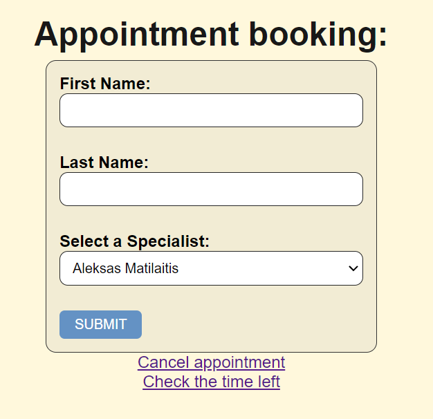
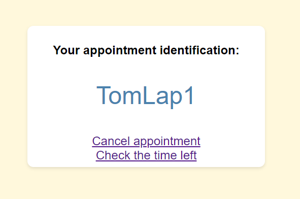
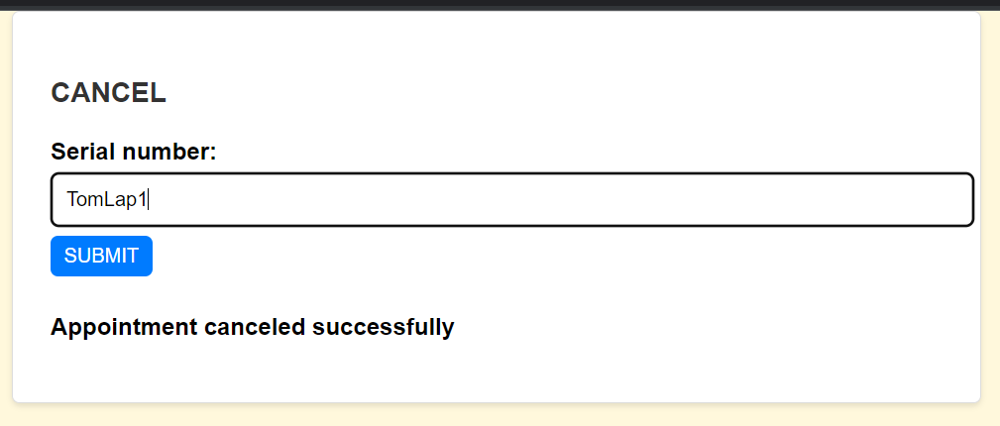
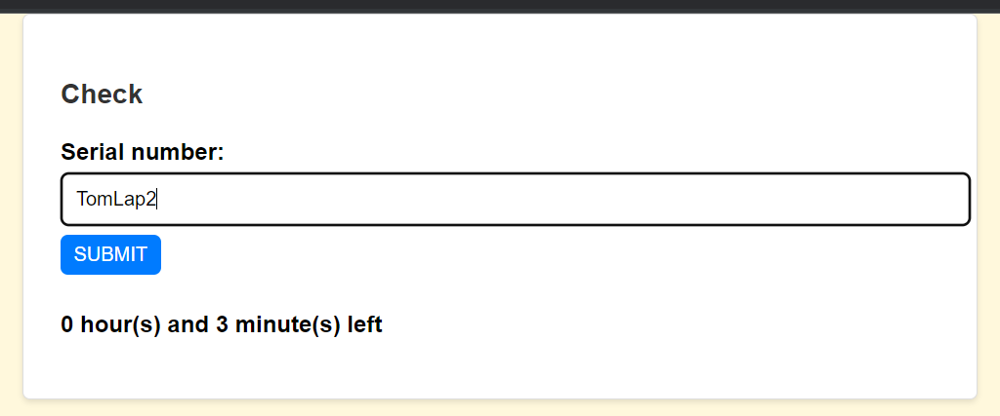
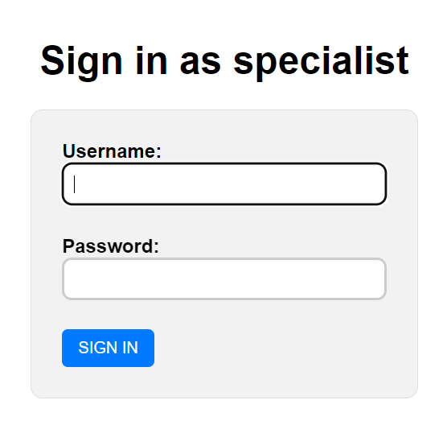
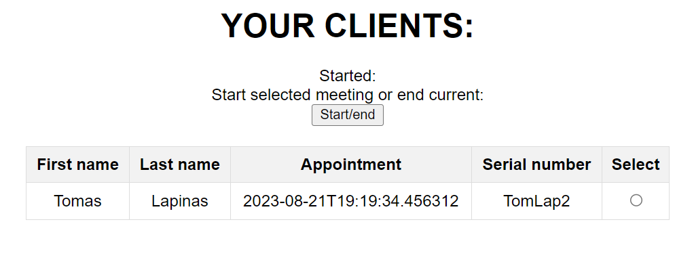

# About

The project is aimed at managing the specialist's clients. 
The clients can register a visit with a certain specialist on the website. The client is placed in a queue for the specialist. Then the serial number is provided for the client to check the time until the meeting or cancel the visit. Top upcoming visit serial numbers can be seen on display boards in customer service departments (bank, outpatient clinic, post office, etc.). Furthermore, specialists can see their clients and start and end meetings when logged in to their accounts. 

> NOTE: The project does not have the display board code yet.

## Tech stack
### Project is created with:

* Java 17
* Maven
* Spring boot 3.1.2
* Thymeleaf
* CSS
* HTML
* PostgreSQL

## Run locally

### First

* clone or download the repo
* [download and install java JDK version 17 and set JAVA_HOME](https://docs.oracle.com/cd/E19182-01/821-0917/inst_jdk_javahome_t/index.html)

### Set up PostgreSQL:

##### In application.properties:

* `spring.datasource.url=jdbc:postgresql://YOUR_URL:YOUR_PORT/YOUR_DATABASE`
* `spring.datasource.username` and `spring.datasource.password`
* `spring.jpa.hibernate.ddl-auto`, **IMPORTANT** add 'client_sequence' to the database manually.

##### Running

*  build .jar: `./mvnw clean install`
*  run the application: `./name.jar`

> **NOTE:**
* Change `appointmentLengthInMinutes` in `clientService` and `SpecialistService`, when the database will have 0 active entries because it will mess up the appointment time calculations when canceling or starting and ending the meetings.
* You can add specialists directly to the database:  
INSERT INTO specialist (id, username, full_name, password) VALUES (nextval('specialist_seq'), 'username', 'fullName', 'password');

## Host

``

## How to use

#### For registering a client: 'your_domain/' 

#### Canceling the visit: 'your_domain/cancel' 

#### Check the time until the visit: 'your_domain/check' 

#### Check the time until the visit: 'your_domain/login' 

## THINGS TO ADD AND FIX

#### FIX
* Specialists page is viewable (specialist can see his clients), but starting and ending meeting needs fixing

#### WHAT TO IMPROVE/ADD
* **Add new module for a local display board to see current visits with the status 'ATTENDING' and 7 upcoming visits with the status 'WAITING'**
* Remove fetching large client lists to `List<>` for updates. Implement batch update.
* Add security configuration and improve specialist authentication. Add password encryption.
* Some queries might be slow when querying large data lists
